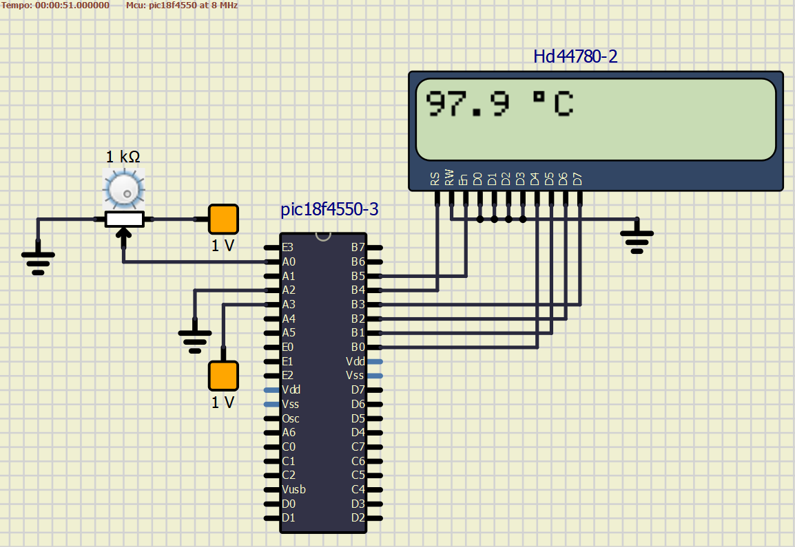
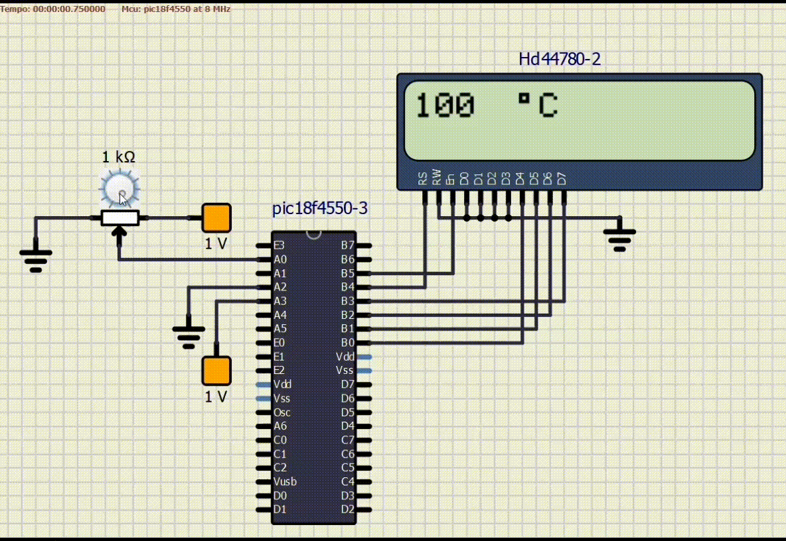

# Termômetro Digital com LM35 e Conversor A/D

## Integrantes
- André Jacob Suaide - **13864673**
- Henrique de Oliveira Araujo - **13863950**
- Oliver Kenzo Kobayashi - **13676930**
- Vítor Augusto Paiva de Brito - **13732303**

Este repositório contém o projeto para a disciplina de **Aplicação de Microprocessadores (SEL0614)**, no qual será desenvolvido um termômetro digital com o sensor LM35 e um conversor analógico-digital no ***PIC18F4550*** em linguagem **C**.

* **Observação**: O código e a documentação do desafio estão armazenados no diretório `Voltimetro`.

---

# Conceitos utilizados

Nesta seção, serão desenvolvidos os principais conceitos utilizados no relatório.

## Conversor Analógico-Digital (ADC)

O conversor ***ADC*** é fundamental no projeto, pois converte sinais analógicos (como a saída do sensor ***LM35***) em valores digitais que podem ser processados pelo microcontrolador. No caso do ***PIC18F4550***, o ADC possui uma resolução de **10 bits**, permitindo quantizar tensões em **1024 níveis** distintos. Isso é essencial para traduzir a variação de tensão (proporcional à temperatura) em valores discretos que podem ser usados em cálculos.

## Configuração de Referências de Tensão (Vref)

*Vref+* foi ajustado para **1V** e *Vref-* para **0V**. Isso foi realizado conectando alimentação externa aos pinos ***AN2*** e ***AN3***, configurando o registrador **ADCON1**. Essa configuração reduz o intervalo de leitura, aumentando a sensibilidade do conversor em relação ao sensor ***LM35***, cuja saída varia **10mV** por °C.

## Sensor LM35

O ***LM35*** é um sensor de temperatura linear, cuja saída é diretamente proporcional à temperatura em °C (**10mV/°C**). Por exemplo:

* Para 25 °C, a saída é **250mV**.
* Para 100 °C, a saída é **1000mV**.

##  Interface com o Display LCD

O display ***LCD*** opera em modo de **4 bits** para economia de pinos. Os dados são enviados pelos pinos **D4-D7**, e os sinais de controle (***RS*** e ***EN***) determinam se os dados são comandos ou caracteres.

## Bibliotecas e Funções do *MikroC PRO*

* ***ADC Library***: Funções como `ADC_Init()` e `ADC_Get_Sample()` abstraem a complexidade da configuração do ***ADC***, permitindo focar no processamento de dados.

* ***LCD Library***: Permite exibir informações no display com comandos como `Lcd_Init()` para inicializar o display somados a `Lcd_Out()` e `Lcd_Chr()` para mostrar dados formatados.

---

# Explicação do Código

## Configuração de pinos do LCD
```C
sbit LCD_RS at LATB4_bit;
sbit LCD_EN at LATB5_bit;
sbit LCD_D4 at LATB0_bit;
sbit LCD_D5 at LATB1_bit;
sbit LCD_D6 at LATB2_bit;
sbit LCD_D7 at LATB3_bit;

sbit LCD_RS_Direction at TRISB4_bit;
sbit LCD_EN_Direction at TRISB5_bit;
sbit LCD_D4_Direction at TRISB0_bit;
sbit LCD_D5_Direction at TRISB1_bit;
sbit LCD_D6_Direction at TRISB2_bit;
sbit LCD_D7_Direction at TRISB3_bit;
```

Neste trecho, os pinos do microcontrolador são mapeados para as funções do display LCD. Os comandos `sbit` associam os pinos físicos do microcontrolador (LATB e TRISB) às linhas de controle e dados do LCD. Esses pinos controlam as operações do display, como enviar dados e comandos.

---

## Função principal (`main`)
### Declaração de Variáveis
```C
unsigned int adc_value;
float temperature;
char text[5];
```

Três variáveis são declaradas:
- `adc_value`: Armazena o valor digital lido do ADC (Conversor Analógico-Digital).
- `temperature`: Armazena o valor calculado da temperatura em graus Celsius.
- `text`: Um vetor de caracteres usado para exibir a temperatura formatada no LCD.

---

### Inicialização dos Módulos
```C
ADC_Init();                        // Inicializa ADC com configuração padrão
ADCON1 = 0b00110000;               // Configura Vref externa AN2 e AN3

Lcd_Init();                        // Inicializa o LCD
Lcd_Cmd(_LCD_CLEAR);               // Limpa o display
Lcd_Cmd(_LCD_CURSOR_OFF);          // Desliga cursor
```

- `ADC_Init()`: Configura o ADC para operação com os valores padrão do compilador.
- `ADCON1`: Configura a referência de tensão externa (AN2 e AN3) para o ADC.
- `Lcd_Init()`: Inicializa o LCD, preparando-o para receber comandos e dados.
- `Lcd_Cmd(_LCD_CLEAR)`: Limpa a tela do LCD.
- `Lcd_Cmd(_LCD_CURSOR_OFF)`: Desativa o cursor do display, deixando apenas o texto visível.

---

### Loop principal
```C
while(1) {
    adc_value = ADC_Get_Sample(0);                  // Lê o valor do canal AN0
    
    temperature = (adc_value * 100.0) / 1023.0;     // Cálculo da temperatura

    // Formata o texto para exibição
    FloatToStr(temperature, text);  // Converte float para string
    text[4] = '\0';                 // Limita o text em 4 caracteres

    Lcd_Out(1, 1, text);            // Exibe a temperatura no LCD
    Lcd_Chr(1, 6, 0xDF);            // Exibe o símbolo de grau
    Lcd_Out(1, 7, "C");             // Exibe o C

    Delay_ms(20);                   // Aguarda 20 ms antes de nova leitura
}
```

#### Blocos do Loop:
1. **Leitura do ADC**:
   ```C
   adc_value = ADC_Get_Sample(0);
   ```
   - Lê o valor analógico do canal AN0 e o converte para um valor digital entre 0 e 1023.

2. **Cálculo da Temperatura**:

    A valor analógico obtido é convertido para um valor digital com **1024 níveis**, com valores no intervalo **[0, 1024]**, com valores de temperaturas possíveis no intervalo **[0, 100]**, proporcional à temperatura do sensor ***LM35***. Assim, a equação de obtenção da temperatura é dada por:

    $$
        Temperatura = \frac{Valor\_ ADC}{1023} \times 100
    $$

    Desse modo, no código, a temperatura é obtida a partir de:

   ```C
   temperature = (adc_value * 100.0) / 1023.0;
   ```
   - Transforma o valor digital do ADC em temperatura em graus Celsius. O sensor é assumido como linear entre 0°C e 100°C.

3. **Formatação do Texto**:
   ```C
   FloatToStr(temperature, text);
   text[4] = '\0';
   ```
   - `FloatToStr`: Converte o valor calculado (float) para uma string.
   - `text[4] = '\0'`: Garante que o texto não exceda 4 caracteres, adicionando o terminador de string.

4. **Exibição no LCD**:
   ```C
   Lcd_Out(1, 1, text);            // Exibe a temperatura no LCD
   Lcd_Chr(1, 6, 0xDF);            // Exibe o símbolo de grau
   Lcd_Out(1, 7, "C");             // Exibe o C
   ```
   - `Lcd_Out`: Exibe a string `text` na posição 1 da linha 1 do LCD.
   - `Lcd_Chr`: Mostra o símbolo de grau (°) na posição 6.
   - Outro `Lcd_Out` exibe o caractere "C" indicando graus Celsius.

5. **Delay**:
   ```C
   Delay_ms(20);
   ```
   - Insere um atraso de 20 milissegundos antes de realizar outra leitura do ADC.

---

# Resultados obtidos

Como resultado final do desenvolvimento, obteve-se um display *LCD* que exibe a temperatura do sensor ***LM35*** a medida que o valor analógico no mecanismo era alterado, obseravava-se uma alteração diretamente proporcional na temperatura medida, como era aspirado na documentação do projeto.

---

# Simulações

No ***SimulIDE***, foi possível contruir o modelo e executar a simulação da operação do circuito em questão.

<p align="center">
  
</p>

Ademais, foi possível executar o código de funcionamento do sistema no software e assegurar a operação correta.

<p align="center">
  
</p>

Assim, é razoável atestar o correto funcionamento do circuito de obtenção da temperatura com o sensor ***LM35*** e o display *LCD*.