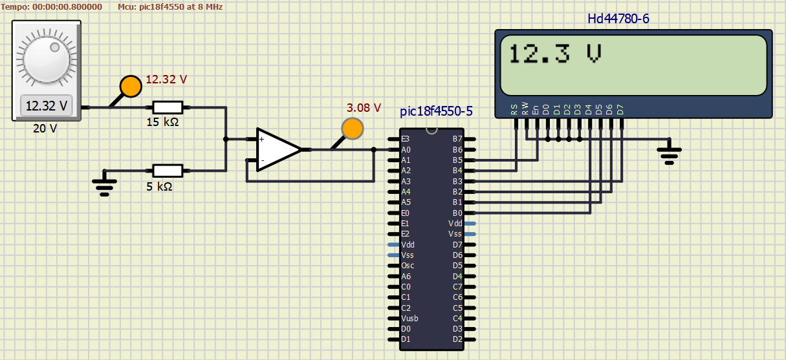

# Voltímetro Digital com Microcontrolador *PIC*

## Contexto do projeto

Este projeto segue as diretrizes do desafio de desenvolver um voltímetro digital para a disciplina ***SEL0614 - Aplicações de Microprocessadores*** como desafio.

O projeto implementa:

* Leitura do ***ADC*** para valores de **0** a **5V**.
* Escalonamento para exibir valores entre 0 e 20V no display *LCD*.
* Uso de bibliotecas do ***MikroC PRO*** for ***PIC*** para simplificar a configuração e interface com o hardware.

## Explicação do Código

### Cálculo do divisor de tensão

Tomando a relação entre a tensão de entrada e de saída no circuito como:

$$
V_{out} = V_{in} \times \frac{R_2}{R_1 + R_2}
$$

Considerando uma entrada máxima de **20V** para uma saída máxima de **5V** somadas a uma relação linear entre as variáveis, é necessário:

$$
\frac{V_{out}}{{V_{in}}} = \frac{R_2}{R_1 + R_2} = \frac{5}{20} = 0.25 \Rightarrow 0.75 \times R_2 = 0.25 \times R_1 \Rightarrow R_1 = 3 \times R_2
$$

Portanto, é possível tomar:

$$
\bullet R_1 = \textbf{15 kΩ} \quad \quad \quad \bullet R_2 = \textbf{5 kΩ}
$$

Desse modo, assegura-se que:

$$
\begin{aligned}
V_{out_{min}} & = 0 \times 0.25 = 0V \quad \quad \quad
V_{out_{max}} & = 20 \times 0.25 = 5V
\end{aligned}
$$

### Configuração dos pinos do *LCD*
```C
sbit LCD_RS at LATB4_bit;
sbit LCD_EN at LATB5_bit;
sbit LCD_D4 at LATB0_bit;
sbit LCD_D5 at LATB1_bit;
sbit LCD_D6 at LATB2_bit;
sbit LCD_D7 at LATB3_bit;

sbit LCD_RS_Direction at TRISB4_bit;
sbit LCD_EN_Direction at TRISB5_bit;
sbit LCD_D4_Direction at TRISB0_bit;
sbit LCD_D5_Direction at TRISB1_bit;
sbit LCD_D6_Direction at TRISB2_bit;
sbit LCD_D7_Direction at TRISB3_bit;
```
Configura os pinos digitais do PORTB para controlar o display LCD no modo de 4 bits, utilizando as bibliotecas do MikroC PRO for PIC. Esta etapa é crucial para a interface com o hardware do LCD.

### Inicialização do programa
```C
void main() {
    unsigned int adc_value;
    unsigned long voltage;
    char text[16];

    ADC_Init();                     // Inicializa o módulo ADC
    Lcd_Init();                     // Inicializa o LCD
    Lcd_Cmd(_LCD_CLEAR);            // Limpa o display
    Lcd_Cmd(_LCD_CURSOR_OFF);       // Desliga o cursor
```
Configurações iniciais para preparar o ADC e o LCD. É importante garantir que o ADC_Init seja chamado antes de usar funções relacionadas ao ADC.

### Loop principal
```C
    while(1) {
        adc_value = ADC_Get_Sample(0);              // Lê o valor do canal AN0
        voltage = (adc_value * 5000UL) / 1023;      // Converte para milivolts (0-5000) [mV]
        voltage = voltage * 4;                      // Ajusta para a escala de (0-20) [mV]
```
O loop principal realiza leituras contínuas do canal ADC configurado no pino AN0. A conversão de tensão é escalada para refletir a faixa de 0 a 20V, simulando um voltímetro.

### Formatação e exibição no LCD
```C
        text[0] = (voltage / 10000) + '0';           // Dezena de volts
        text[1] = ((voltage / 1000) % 10) + '0';     // Unidade de volts
        text[2] = '.';                               // Ponto decimal
        text[3] = ((voltage / 100) % 10) + '0';      // Primeira casa decimal
        text[4] = ' ';                               // Espaço
        text[5] = 'V';                               // Unidade (Volts)
        text[6] = '\0';                              // Finaliza a string

        Lcd_Out(1, 1, text);  // Exibe a tensão no LCD
```
A formatação do valor lido é feita manualmente, convertendo o resultado em caracteres ASCII para exibição no LCD, com precisão até uma casa decimal.

### Controle de tempo
```C
        Delay_ms(20);  // Aguarda 20 ms
```
Um pequeno atraso é inserido para estabilizar a leitura e evitar flutuações visíveis no display.

---

## Simulações

Com a utilização do software ***SimulIDE***, tem-se o **diagrama esquemático** do circuito do voltímetro digital.

<p align="center">
  
</p>

Com isso, é possível simular o funcionamento do circuito e assegurar sua correta operação, variando a tensão de entrada (**V<sub>in</sub>**) entre **0V** e **20V**, esperando que a tensão de saída (**V<sub>out</sub>**)  esteja no intervalo entre **0V** e **5V**, conforme os cálculos teóricos.

<p align="center">
  
</p>

Desse modo, é possível observar que a tensão de saída se comporta de acordo com o desejado.